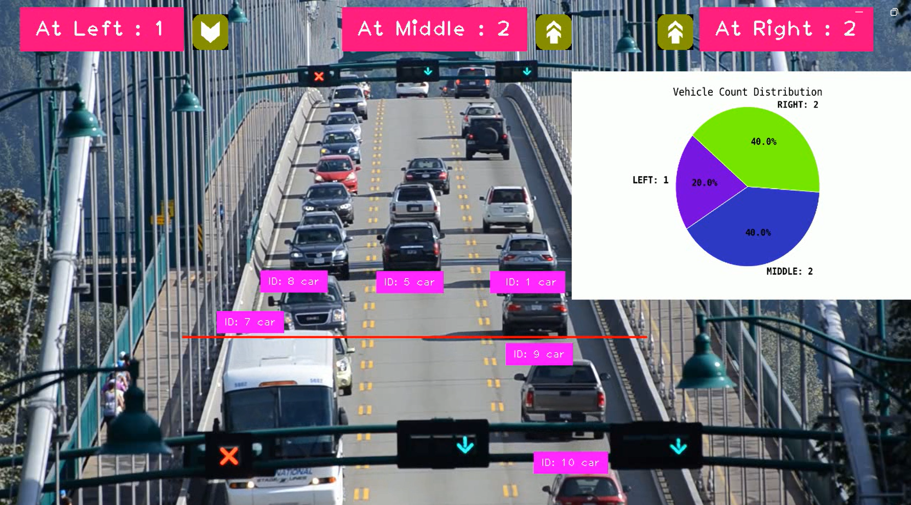

Realtime road traffic monitoring with analytics chart plotting

- By combining the SORT (Simple Online and Realtime Tracking) algorithm with YOLOV8, we ensure objects are efficiently tracked by predicting their movement and updating their positions in real-time.
- To implement vehicles counting, three regions have been defined : two for vehicles going up and one for vehicles going down on the road.